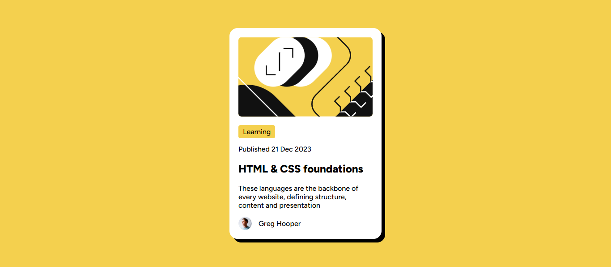

# Frontend Mentor - Blog preview card solution

This is a solution to the [Blog preview card challenge on Frontend Mentor](https://www.frontendmentor.io/challenges/blog-preview-card-ckPaj01IcS). Frontend Mentor challenges help you improve your coding skills by building realistic projects.

## Table of contents

- [Overview](#overview)
  - [Screenshot](#screenshot)
  - [Links](#links)
- [My process](#my-process)
  - [Built with](#built-with)
  - [What I learned](#what-i-learned)
  - [Continued development](#continued-development)
- [Author](#author)

## Overview

### Screenshot



### Links

- Solution URL: [solution URL](https://your-solution-url.com)
- Live Site URL: [live site URL](https://blog-card-preview-ga2j.vercel.app/)

## My process

### Built with

- Semantic HTML5 markup
- CSS custom properties
- Flexbox
- Mobile-first workflow

### What I learned

I learnt how to use flexbox and position property especially when centerring a div.heres how you can do it too.
we have a div

```html
<body>
<div class=test-div>This is a div</div>
</body>
```
so now the div will be positioned at the top left corner of the page.
to center it well use the following css

```css
/* Targets the <body> element (the main container of your webpage) */
body {
   /* Makes the body a flex container so it can use flexbox properties to arrange its children */
   display: flex;
   
   /* Horizontally centers all direct children of the body (like .test-div) on the page */
   justify-content: center;
   
   /* Vertically centers all direct children of the body (like .test-div) on the page */
   align-items: center;
   
   /* Makes body at least 100% of viewport height so vertical centering works properly */
   min-height: 100vh;
}

/* Targets elements with the class "test-div" */
.test-div {
     background-color: red; /*Sets the colour to red so its easy to spot the div */
   }

  ```
  Try this out yourself!

  also something important i learned while doing this project was to add hover effects.To add a hover effect specify the type of movement you want in the element inside the elements style

  ```css
.test-div {
     background-color: red;
     transition: color 0.3s ease-in;
      /* The first parametre is on which we want to add our hover effect is it on color, backround colour, width etc the second one is the speed and the third one is the style is it eas-in, ease-out, ease-in-out likewise */
   } 
   ```


### Continued development

Looking to add some hover effect on the card,add a transform animation on the pill and some backrounds too.

## Author

- Website - [Umair Faiser](https://blog-card-preview-ga2j.vercel.app/)
- Frontend Mentor - [@UmairFaiser](https://www.frontendmentor.io/profile/UmairFaiser)
- Twitter/x - [@UmairFaiser](https://www.twitter.com/UmairFaiser)

